# R2S — Revenue Recovery System

**Razorpay AI Buildathon · Track 03 (AI Revenue Recovery)**
**Status:** feature-complete, tested, evaluated · **Cost:** ₹0 (no paid APIs, no external services)

R2S is a simulation-first, policy-governed AI advisor for failed-payment recovery. When a payment fails, it builds an assessment from the payment's *observable* history, asks a mock AI agent what to do, passes that recommendation through a deterministic policy layer that has final authority, and only then executes a **simulated** recovery action — with durable idempotency and full metrics/evaluation on top.

It is evaluated head-to-head against a deterministic baseline retry strategy across a synthetic dataset, using a fairness-first methodology (identical worlds, independent databases, hidden ground truth, shared decision budgets). The results are reported honestly below, including where R2S currently loses.

---

## 1. The problem

When a payment fails, a merchant has to decide what to do next, per payment, at scale:

- Some failures (e.g. a transient bank timeout) are worth retrying immediately; others (e.g. an expired card) will never succeed on retry no matter how many times you try.
- Unnecessary retries cost processing overhead and can trigger fraud/risk flags, with no chance of recovering revenue.
- Premature escalation to a human/manual process is expensive and slow, and often unnecessary if a simple nudge (e.g. "update your payment method") would work instead.
- A meaningful share of failed payments *are* recoverable — but the right action depends on the failure category, how many times it has already failed, and how much of the recovery window is left.

A policy-controlled AI advisor can reason over per-payment context to recommend a more targeted action than a one-size-fits-all retry schedule, while a deterministic policy layer keeps the AI from making unsafe or ungoverned decisions.

---

## 2. Architecture

```
Simulation → Assessment → Agent-safe Context → AI Decision → Policy →
Idempotency → Executor → Outcome → Lifecycle → Metrics → Evaluation
```



```mermaid
flowchart LR
    SIM["Simulation<br/>synthetic world, seeded RNG,<br/>hidden ground truth"]
    ASM["Assessment<br/>observable-only features,<br/>score, candidate actions"]
    CTX["Agent-safe Context<br/>ground truth structurally<br/>excluded"]
    AI["AI Decision<br/>MockAIProvider, advisor only,<br/>no paid API"]
    POL["Policy Engine<br/>final authority — approve /<br/>modify / block"]
    IDEM["Idempotency<br/>SQLite-unique key,<br/>reserve-before-execute"]
    EXE["Executor<br/>simulation-only,<br/>never a real gateway"]
    OUT["Outcome<br/>action-conditioned,<br/>payment-local RNG"]
    LIFE["Lifecycle<br/>open → retrying →<br/>recovered / failed / stopped"]
    MET["Metrics & Evaluation<br/>baseline vs R2S,<br/>5-seed aggregate"]

    SIM --> ASM --> CTX --> AI --> POL --> IDEM --> EXE --> OUT --> LIFE --> MET
    SIM -.hidden ground truth,<br/>never exposed.-> MET
```

| Layer | Responsibility |
|---|---|
| **Simulation** | Generates a synthetic world (merchants, customers, payments) with a hidden ground truth of failure category and "best action," using a seeded RNG for reproducibility. This is the only place ground truth is allowed to exist. |
| **Assessment** | Builds `RecoveryFeatures` from the payment's *observable* history only (failure category, prior attempt count, window remaining, case status) — deliberately blind to ground truth. Produces a recovery score and a ranked list of candidate actions. |
| **Agent-safe Context** | A sanitized `AgentPaymentContext` / `AgentDecisionRequest` is built from the assessment — the only thing ever shown to the AI. Ground truth is structurally excluded from this object, not just conventionally hidden. |
| **AI Decision** | A `MockAIProvider` (no paid API) returns a structured decision from a fixed action vocabulary, following a defined prompt template and JSON schema, with candidate translation mapping AI actions to the operational vocabulary. |
| **Policy** | Deterministic policy engine with final authority: enforces max retries, recovery window, incentive caps, and a high-value threshold. Can approve, modify, or block the AI's recommendation. |
| **Idempotency** | Every approved action is keyed by a durable, unique idempotency key (SQLite unique constraint on `RecoveryAttempt.idempotencyKey`), reserved before execution, so the same action can never be double-executed — even across a crash and restart. |
| **Executor** | Simulation-only — it never touches a real payment gateway. It executes the policy-approved action against the simulated world. |
| **Outcome** | Action-conditioned outcome simulation: the result of an action depends on *which* action was taken, drawn from a payment-local RNG stream so outcomes are fairly comparable across strategies. |
| **Lifecycle** | Tracks each recovery case through its states (open → retrying → recovered / failed / stopped / escalated). |
| **Metrics / Evaluation** | Aggregates recovery rate, revenue, attempts, efficiency, and decision-quality metrics, and runs the baseline-vs-R2S comparison across multiple seeds. |

### Recovery actions

| Action | Meaning |
|---|---|
| `RETRY_NOW` | Immediate retry — for failures expected to resolve quickly (e.g. transient bank failure). |
| `RETRY_LATER` | Delayed retry — for failures where giving the customer time helps (e.g. insufficient funds). |
| `SEND_PAYMENT_LINK` | Prompt the customer to update their payment instrument — for invalid-instrument or authentication failures. |
| `ESCALATE` | Route to a human/manual process — for cases judged unlikely to self-resolve. |
| `STOP` | Take no further action — window expired or continued effort isn't worthwhile. |

### Safety, policy & idempotency

- **Policy limits (defaults):** `maxRetries = 3`, `recoveryWindowDays = 7`, `maxIncentivePercent = 15%`, `highValueThresholdMinor = ₹5,000`.
- **AI is advisor-only.** It never executes anything, never sees ground truth, and cannot bypass policy. If the AI provider errors, a deterministic fallback path is used instead of failing the pipeline or defaulting to an unsafe action.
- **Policy has final authority.** It can approve, downgrade, or block any AI recommendation based on retry counts, recovery-window state, incentive limits, and payment value.
- **Durable idempotency.** Every executed action is keyed by a SQLite-unique `RecoveryAttempt.idempotencyKey` under a reserve-before-execute pattern, validated by a genuine crash-simulation (process-restart) test — not just an in-memory guard.
- **`STOP` / `ESCALATE` never execute.** These terminal decisions explicitly produce no `action_executed` record.
- **Simulation-only executor.** No real payment gateway or financial operation is ever touched, which is what makes the ₹0-cost, no-real-payment-risk claim true.

### Ground-truth isolation

The true best action and failure semantics exist only in the simulation layer. The assessment, agent context, and AI prompt are built exclusively from *observable* features — never from ground truth. This is enforced structurally (the agent-safe context type cannot carry ground-truth fields) and verified by dedicated isolation tests, not just by convention. If ground truth could leak into the assessment or AI context, the system could trivially "solve" recovery by reading the answer key, which would make any recovery-rate result meaningless.

---

## 3. Evaluation methodology

**Fairness setup.** Each seed builds exactly one initial synthetic world, then materializes byte-identical copies into two fully independent in-memory SQLite repositories — one per strategy (baseline, R2S). Only the decision strategy differs between the two runs; mutating one repository cannot affect the other. Both strategies see the same payment IDs, amounts, failure categories, initial state, and hidden ground truth (which remains hidden from both).

**Temporal fairness.** R2S calls its orchestrator repeatedly per payment, but every decision cycle — including `RETRY_LATER` — consumes one decision opportunity from the *same* shared budget the baseline gets (`maxRetries = 3`). R2S never gets more chances at a payment than the baseline, even though its retry *timing* can differ.

**The RNG problem we found and fixed.** The original evaluation used one mutable RNG stream *per strategy*, consumed sequentially as payments were processed. Because a payment's number of random draws depends on how many attempts it took, if payment A drew a different number of random values under baseline vs. R2S, every payment processed *after* A received different random draws under the two strategies — a real cross-payment contamination effect that had nothing to do with decision quality. We diagnosed this ourselves, rather than accepting the first result, and corrected it: each payment now derives its outcome RNG from `createRng(\`${world.seed}:${paymentId}\`)` — the same seed, for the same payment, under both strategies, independent of every other payment's history. This is a **methodology-only** fix; it does not touch any business logic, threshold, or model behavior. It is implemented identically in both `src/evaluation/strategies/baselineStrategy.ts` and `src/evaluation/strategies/r2sStrategy.ts`.

**Decision-quality metrics.** Reported separately as `groundTruthLabelAgreementRate` (how often R2S's chosen action matches the hidden best action) and `bestAvailableActionAgreementRate` (how often it matches the best action *among the candidates actually offered* at that decision — a fairer measure of decision quality within the assessment engine's own candidate set).

---

## 4. Results — reported honestly

**Baseline vs. R2S, 5-seed aggregate mean** (`evaluation-results/evaluation-v1.json`):

| Metric | Baseline | R2S | Delta |
|---|---:|---:|---:|
| Recovery rate | 56.99% | 53.50% | −3.49 pp |
| Recovered revenue / seed | ₹8,90,134.28 | ₹8,34,993.46 | −₹55,140.82 |
| Executed attempts / seed | 2,116.8 | 1,463.6 | −653.2 (−30.9%) |
| Revenue / attempt | ₹420.41 | ₹570.27 | +₹149.86 (+35.6%) |

**R2S decision quality (candidate-restricted vs. global):**

| Metric | Mean |
|---|---:|
| Ground-truth label agreement rate | 60.3% |
| Best-available-action agreement rate | 67.8% |

**We do not claim R2S beats baseline on recovery rate or revenue.** It does not, on this evaluation. R2S does decisively win on **efficiency** — it recovers more revenue *per attempt* while executing about 31% fewer attempts than baseline. This is a real trade-off (fewer, better-targeted actions vs. exhaustive retrying), not a wash.

### Diagnosis and a controlled fix

Rather than tuning the result away, we diagnosed where R2S was losing and found the gap concentrated in a small number of failure categories. We identified one narrowly-scoped, pre-specified change: raising the escalation threshold in the assessment engine's candidate-action logic from "any prior failure" (`> 0`) to "at least two prior failures" (`>= 2`) before a low-scoring payment is offered `ESCALATE` as a candidate. We ran a controlled A/B on this single change:

| Metric | Variant A (`>0`) | Variant B (`>=2`, current) | B − A |
|---|---:|---:|---:|
| Recovery rate | 50.21% | 53.50% | +3.29 pp |

The improvement was reproducible across all 5 seeds and isolated to the intended categories, with no effect on unrelated ones. `evaluation-v1.json` on this branch already reflects Variant B under the corrected RNG methodology.

---

## 5. What this means, honestly

- The engineering — simulation, assessment, AI/policy pipeline, durable idempotency, evaluation harness, and the RNG-fairness fix — is complete, tested, and internally consistent.
- The **product** does not yet beat the baseline it's compared against on raw recovery. It beats it on efficiency and cost per recovered rupee, not on total revenue recovered.
- We investigated the loss instead of hiding it, found and fixed a genuine flaw in our own evaluation methodology, and made one narrowly-scoped, evaluated improvement — all without touching ground truth, the outcome model, or the baseline.

---

## 6. How to run it

**Requirements:** Node.js 22+ (for built-in `node:sqlite`), npm.

```bash
# install
npm install

# type-check (should be clean)
npx tsc --noEmit

# run the full test suite
npm test

# regenerate a sample synthetic world
npm run seed

# run the full baseline-vs-R2S evaluation (writes evaluation-results/evaluation-v1.json)
npm run evaluate
```

**Current verified state:** 378 tests passing across 37 test files, zero TypeScript errors.

> **Note on Prisma:** `prisma/schema.prisma` is the authoritative, production-ready data model. In this sandboxed evaluation environment, Prisma's engine binary download is blocked by network egress rules, so the test/evaluation runtime uses Node 22's built-in `node:sqlite` as a drop-in execution driver instead. This is a sandbox-only substitution — the schema itself is what a production deployment would run against.

---

## 7. What is deliberately frozen

Per the project's own design-freeze discipline, the following are not touched by evaluation or documentation work, and were not touched to produce this report:

- Assessment logic, other than the single approved `>=2` threshold change described above.
- AI semantics (prompt template, schema, candidate translation).
- Policy semantics (limits, thresholds, authority rules).
- Generator semantics (world generation, failure taxonomy).
- Ground truth (values and isolation boundary).
- Outcome model (action-conditioned outcome logic).
- Baseline strategy behavior.
- Evaluation semantics (fairness methodology, metric definitions), beyond the approved RNG fix.
- No further tuning based on results.

---

## 8. Repository layout

```
src/
  ai/            AI provider interface, MockAIProvider, prompt template, candidate translation
  assessment/    Context builder, feature extraction, scoring, candidate actions
  db/            SQLite-backed repository layer (node:sqlite driver)
  domain/        Core types and the payment/recovery state machine
  evaluation/    Cohort construction, strategy adapters, metrics, aggregation, CLI
  execution/     RecoveryExecutor — simulation-only action execution
  orchestration/ Orchestrator, lifecycle transitions, decision resolver
  outcome/       Action-conditioned outcome simulation
  policy/        Deterministic policy engine and rules
  simulation/    Synthetic world generator, ground truth, failure taxonomy
  strategy/      Deterministic baseline retry strategy
  meta/          Version tags for generator, dataset, assessment engine, evaluation
  cli/           evaluate.ts — the evaluation CLI entry point
prisma/          Authoritative Prisma schema (production data model)
tests/           378 tests across 37 files
evaluation-results/evaluation-v1.json   Committed evaluation output (Variant B, corrected RNG)
docs/            Demo script and supplementary docs
```

---

## 9. Demo

See [`docs/DEMO_SCRIPT.md`](docs/DEMO_SCRIPT.md) for a 3–5 minute walkthrough script covering the full pipeline, the honest results, and the RNG-diagnosis story.

---

## 10. Constraints

- **₹0 cost.** All dependencies are free/open-source. No paid APIs, no external services. The AI layer is a deterministic mock standing in for an LLM call, satisfying the buildathon's no-paid-API rule while preserving the advisor/policy architectural split a real LLM integration would use.
- **Simulation only.** No real payment gateway, no real customer contact, no real money — by design.
- **No frontend/dashboard.** This is a backend simulation and evaluation system; results are inspected via the test suite, the evaluation CLI, and the committed JSON report.

Built for Razorpay AI Buildathon, Track 03 (AI Revenue Recovery).
